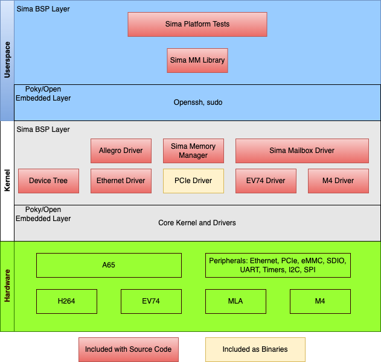

.. SPDX-License-Identifier: CC-BY-SA-2.0-UK

**********************************
Sima AI Board Image Build Manual
**********************************

=====================

Sima AI BSP Layer
=====================

The following diagram shows the Sima AI BSP layer on the top of the poky layer of the Yocto project.
The current Yocto linux kernel version that is being used is 6.1.22.

|

|

------------------

Kernel Components
------------------

All the drivers managing different SOC interfaces and components are built along with the customized linux kernel.

The following repository points to the source code of customized linux kernel for Sima AI SOC.

Repo Link: https://github.com/SiMa-ai/simaai-linux.git

----------------------

Userspace Components
----------------------

Platform tests are available for different components of Sima AI SOC. These tests can help testing the interfaces and components in Sima AI soc. 

======

Build
======

Prerequisites
--------------

#. Please check `Compatible Linux distributions <https://docs.yoctoproject.org/ref-manual/system-requirements.html?highlight=system+packages#supported-linux-distributions>`_
   
   .. note::
      WSL OS is not supported by Yocto. We recommend Ubuntu 22.04.
#. Additional packages for Ubuntu 22.04:
   ::
   
     sudo apt-get install chrpath diffstat g++ gawk make liblz4-tool cmake python3 \
     python3-distutils libncurses5 git gfortran
       
#. To install 32 bit execution environment please run below commands::

     sudo dpkg --add-architecture i386
     sudo apt update
     sudo apt install libc6:i386

------------

Terminology
------------
- recipe : Recipes in Yocto, provide instructions about how to build a repository or source code. It provides many steps to build it, importantly fetching source code, applying patches, configuring, compiling, linking,  installation etc . All the files in meta-simaai repo that has .bb or .bbappend suffix are recipes

- layer : A layer in Yocto is collection of recipes with common goal. Name of the layer in Yocto needs to have “meta-” string appended to it. meta-simaai is the layer which has all recipes from Sima.ai for Davinci.

- meta-simaai : This is BSP (Board support package) layer for boards form Sima.ai. It provides recipes which builds artifacts needed to bring up (with other important application) boards.

- bitbake : Bitbake is a scheduler that schedules a recipe to build. It resolves dependencies of build artifacts needed to build the current recipe, hence it will build dependent recipes first to make sure current recipe is ready to build.

-----------------------

Build Minimal BSP Image
-----------------------

Following are the steps to build minimal yocto image for sima AI development
boards. Steps to flash or load the image will be discussed in a separate document.

- Download the repo and dependencies. 

  .. note::
      You will need to download all repos in the same folder.

  #. Download Yocto project
     ::

       git clone git://git.yoctoproject.org/poky -b scarthgap

       cd poky

       git fetch --tags

       git checkout scarthgap-5.0.6

  #. Download Clone meta-clang
     ::
       git clone https://github.com/kraj/meta-clang.git -b scarthgap

       cd meta-clang

       git reset --hard 8c77b427408db01b8de4c04bd3d247c13c154f92

  #. Download Clone meta-clang-revival
     ::
       git clone https://github.com/zboszor/meta-clang-revival.git -b scarthgap

       cd meta-clang-revival

       git reset --hard 1855a8e8be9e600d48fa354670f8d968ed1b1d02

  #. Download Clone meta-openembedded
     ::
       git clone https://github.com/openembedded/meta-openembedded.git -b scarthgap

       cd meta-openembedded

       git reset --hard dda0d53326017d6758ec6bdfdaf2f484c089d13f

  #. Download openembedded-core
     ::
       git clone https://git.openembedded.org/openembedded-core -b scarthgap

       cd openembedded-core

       git reset --hard 62cb12967391db709315820d48853ffa4c6b4740
     

  #. Download software update layer
     ::
       git clone https://github.com/sbabic/meta-swupdate.git -b scarthgap

       cd meta-swupdate

       git reset --hard 4a65b1ed36c0b6ee4942d5f23c4984552b17cfe6

  #. Download Sima AI BSP layer
     ::
       git clone https://github.com/SiMa-ai/meta-simaai.git

- Setup Environment 

  #. Source layers and config files using template file. Custom folder of meta-simaai has two files, which the yocto uses to populate bblayers.conf and local.conf file.
     ::

          export TEMPLATECONF=<path to meta-simaai>/meta-simaai/conf/templates/custom
 
  #. The following command will create and change the current directory to the new directory build.
     ::

          source poky/oe-init-build-env
 
  #. Verify layers:: 

          $ bitbake-layers show-layers
          NOTE: Starting bitbake server...
            layer                 path                                                priority
            ========================================================================================================
            core                  /local/build/../poky/meta                             5
            yocto                 /local/build/../poky/meta-poky                        5
            yoctobsp              /local/build/../poky/meta-yocto-bsp                   5
            meta-simaai           /local/build/../pub-meta-simaai                       8
            meta-python-ai        /local/build/../meta-python-ai                        6
            clang-revival-layer   /local/build/../meta-clang-revival                    6
            clang-layer           /local/build/../meta-clang                            5
            openembedded-layer    /local/build/../meta-openembedded/meta-oe             5
            meta-python           /local/build/../meta-openembedded/meta-python         5
            networking-layer      /local/build/../meta-openembedded/meta-networking     5
            multimedia-layer      /local/build/../meta-openembedded/meta-multimedia     5
            gnome-layer           /local/build/../meta-openembedded/meta-gnome          5
            xfce-layer            /local/build/../meta-openembedded/meta-xfce           5
            swupdate              /local/build/../meta-swupdate                         6

- Building image 
  
  #. The recipe of the minimal image is located at the following location in meta-simaai repo
     ::

        meta-simaai/recipes-core/images

  #. Trigger build
     ::

        For 'davinci'

        MACHINE=davinci bitbake simaai-image-minimal
     ::

        For 'modalix'

        MACHINE=modalix bitbake simaai-image-minimal

  #. Build linux swu update package
     ::

        For 'davinci'

        MACHINE=davinci bitbake simaai-image-minimal-upgrade
     ::

        For 'modalix'

        MACHINE=modalix bitbake simaai-image-minimal-upgrade

  #. Built images can be located at the following location in the build folder
     ::

        For 'davinci'

        build/tmp/deploy/images/davinci
     ::

        For 'modalix'

        build/tmp/deploy/images/davinci
